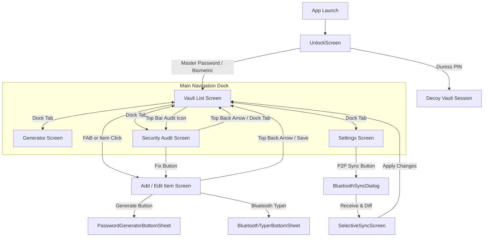

# KryptonVault: Complete Engineering Memory & System Documentation

> **File:** `memory.md`  
> **Package:** `com.example` (`com.aistudio.kryptonvault.pwqd`)  
> **Platform:** Android 8.0+ (API 26–36)  
> **Architecture:** Modern Android (Kotlin, Jetpack Compose, Single Activity, Clean Architecture, Room + SQLCipher, ProcessLifecycleOwner)  
> **Security Model:** Zero-Knowledge, 100% Air-Gapped / Zero-Internet

---

## 1. Executive Summary & Core Identity

**KryptonVault** is a zero-knowledge, 100% offline, air-gapped personal credentials manager and hardware Bluetooth security suite engineered in Kotlin and Jetpack Compose.

Unlike cloud-dependent password managers, KryptonVault operates with **zero network permissions** (`android.permission.INTERNET` is strictly omitted from the manifest). Data never leaves the physical device via TCP/IP. Instead, it offers hardware-grade local security, encrypted peer-to-peer Bluetooth synchronization, hardware Bluetooth HID PC keyboard typing, plausible deniability duress decoys, and a tactile Neumorphic UI optimized for OLED displays.

---

## 2. Core Security & Cryptographic Pillars

### 2.1 100% Air-Gapped (Zero Internet Guarantee)
- `AndroidManifest.xml` contains **no internet permission** (`android.permission.INTERNET`).
- Zero telemetry, zero analytics, zero external API endpoints, zero cloud synchronization.
- Impossible for data to be intercepted, exfiltrated, or leaked over IP networks.

### 2.2 Military-Grade Cryptography
- **Master Key Derivation**: PBKDF2 with HMAC-SHA256 at **120,000 iterations** (`CryptoManager.kt`) executes on `Dispatchers.Default` to prevent UI freezing while producing a 256-bit AES master encryption key.
- **Quick PIN Wrapping**: PBKDF2 with HMAC-SHA256 at **60,000 iterations** wraps the in-memory master key, enabling fast re-entry without re-entering the long master password.
- **Payload Encryption**: Authenticated **AES-256-GCM** using cryptographically secure 12-byte random IVs (generated via `SecureRandom`) and 128-bit authentication tags.
- **Local Storage Encryption**: SQLite database encrypted at rest using **SQLCipher** with key material derived from the master secret.
- **One-Time Export Encryption**: Independent standalone PBKDF2 (10,000 iterations) + AES-256-GCM using a user-specified passphrase for `.krypton` files.

### 2.3 Memory Hygiene & Zeroization
- All sensitive credential inputs, passwords, PINs, and cryptographic keys use `CharArray` and `ByteArray` rather than immutable `java.lang.String` where possible.
- Dedicated memory zeroization functions `CharArray.wipe()` and `ByteArray.wipe()` (`MemorySanitizer.kt`) overwrite sensitive buffers with zeroes in `finally` blocks immediately after use.
- Garbage collection cannot leave plain-text secrets lingering in memory.

### 2.4 Operating System Defenses
- **`FLAG_SECURE`**: Strictly enforced across all windows and dialogs to prevent screen capture, screenshotting, screen recording, and exposure in Android Recent Apps task switchers.
- **Biometric Authentication**: Android Keystore integration (`androidx.biometric.BiometricPrompt`) for fingerprint/face biometric unlock without storing raw biometrics.
- **Scrambled PIN Keypad**: Optional randomized PIN keypad on the unlock screen to defeat shoulder surfing and touchscreen smudge-attack analysis.
- **Auto-Clearing Clipboard**: `ClipboardHelper.kt` copies secrets to clipboard with sensitive flags and automatically clears the clipboard after 30 seconds via a background coroutine.

### 2.5 Process-Level Auto-Lock Logic
- Uses Android's **`ProcessLifecycleOwner`** (`LifecycleManager.kt`) to monitor app-level backgrounding (`onStop`) and foregrounding (`onStart`).
- **Never locks while user is actively using the app**: In-app navigation, dialogs, and activity transitions do not trigger premature locks.
- Once the user switches apps or presses home, the background timestamp is recorded. Reopening the app after the user-configured timeout (10s, 30s, 60s) requires full authentication.
- Supports `suppressNextPause()` to prevent locking when launching system file choosers or sharing exports.

---

## 3. Design System & Theme Architecture

### 3.1 Tactile Neumorphic (Soft-UI) Engine
The application implements an authentic tactile Neumorphic design system (`LiquidGlassComponents.kt`):
- **Extruded (Convex) Surfaces**: Cards and buttons emerge organically from the background with soft lighting on top-left and gentle shadow on bottom-right.
- **Inset (Concave) Sockets**: Input fields, display windows, and icon sockets appear sunken into the surface using inverted border gradients (`neuInsetBorderGradient`) and recessed surface colors (`neuInsetSurface`).
- **Tactile Depress States**: Buttons feature physical press animations with spring damping (`Spring.StiffnessMediumLow`), visually depressing into the screen when pressed.

### 3.2 OLED Pitch-Black Zero-Lag Optimization
- **Dark Mode OLED**: Background is pure `#000000` (`NeutralDarkBackground`), and elevated surfaces use `#121214`.
- **Zero Shadow Overhead**: In dark mode, elevation shadow calculations are bypassed (`elevation = 0.dp`), eliminating GPU jank and maintaining fluid 60fps/120fps scrolling.
- **Zero Color Tinting on Black**: Pitch-black surfaces remain completely neutral black, without color tints or muddy gray overlays.
- **Crisp Minimalist Light Mode**: Light mode features clean pearlescent backgrounds (`#F6F8FA`), pure white cards (`#FFFFFF`), and refined slate borders (`#E2E5E9`).

### 3.3 12 Dynamic Accent & Combination Themes
Configured in `KryptonThemeAccent.kt` and `Color.kt`:
1. **Black & White (Monochrome)**: Pitch Black & Pure White (Default).
2. **Emerald**: Zero-Knowledge Green (`#10B981`).
3. **Cyber Cyan**: Electric Neon Cyan (`#06B6D4`).
4. **Neon Purple**: Deep Tech Amethyst (`#A855F7`).
5. **Crimson Red**: Intense Ruby Red (`#EF4444`).
6. **Amber Gold**: Warm Amber Bronze (`#F59E0B`).
7. **Sapphire Blue**: Cobalt Tech Blue (`#3B82F6`).
8. **Green & White**: Dual split vibrant emerald and crisp white.
9. **Yellow & Brown**: Dual split warm gold and earth brown.
10. **Red & White**: Dual split vivid crimson and crisp white.
11. **Cyan & Orange**: Dual split electric cyan and sunset orange.
12. **Purple & Gold**: Dual split royal amethyst and warm gold.

- **Theme Persistence**: Theme changes are written synchronously to `SharedPreferences` via `.commit()` and initialized in `KryptonApplication.onCreate()`.
- **FlowRow Theme Selector**: Settings display all 12 themes simultaneously in an adaptive wrapping `FlowRow`, with dual-colored canvas circle previews.

### 3.4 Floating Pill Navigation Dock
- Custom bottom navigation bar (`KryptonFloatingNavBar.kt`) floating over the canvas with `navigationBarsPadding()`.
- Unselected tabs show clean icons; the selected tab smoothly expands into an animated stadium pill (`animateContentSize`) showing icon, title, and theme accent.
- Features a bottom home indicator bar line and haptic feedback (`HapticFeedbackType.TextHandleMove`).
- Four primary tabs: **Vault**, **Generator**, **Health**, **Settings**.

---

## 4. Feature Specifications & Technical Details

### 4.1 Vault Management & Item Types
- Supports four credential categories (`VaultItemType`):
  1. **LOGIN**: Title, username/email, password, website URL, TOTP secret, encrypted notes.
  2. **SECURE_NOTE**: Title, multi-line encrypted notes, category.
  3. **CREDIT_CARD**: Cardholder name, card number, expiry date (MM/YY), CVV, category.
  4. **IDENTITY**: Personal details, passport/ID, address, contact information.
- Favorites system (`isFavorite`) with star toggle.
- Real-time search by title, username, category, or notes.
- Quick filter chips: *All*, *Logins*, *Notes*, *Cards*, *2FA*.
- One-tap quick copy actions for username and password.

### 4.2 Integrated TOTP 2FA Authenticator
- RFC 6238-compliant software authenticator (`TotpGenerator.kt`).
- Computes standard 6-digit codes using HMAC-SHA1 with 30-second time steps.
- Live animated countdown circular indicator rendered directly inside vault cards and credential detail views.
- Base32 decoding with whitespace and hyphen stripping.

### 4.3 Shannon Entropy & Security Audit Engine
- **Entropy Formula**: Computes cryptographic Shannon entropy ($H = -\sum p_i \log_2(p_i)$) weighted by character set pool size (`EntropyCalculator.kt`, `HealthAuditEngine.kt`).
- **Health Audit Rules**:
  - **Weak Passwords**: Flags credentials with length < 12 characters or entropy < 45 bits.
  - **Reused Passwords**: Local SHA-256 hash deduplication identifies credential reuse across multiple accounts without storing or exposing plain text.
  - **Old Passwords**: Flags credentials unmodified for more than 180 days.
  - **Crack Time Estimation**: Offline GPU brute-force calculation based on modern hashcat cluster benchmarks.
- **Actionable Remediation**: Each flagged credential features a direct "Fix" button navigating immediately to edit mode.

### 4.4 Cryptographically Secure Password & Passphrase Generator
- **Random Password Mode**: Configurable length (8 to 64 characters), uppercase (A-Z), lowercase (a-z), digits (0-9), symbols (`!@#$%^&*`), and exclusion of visually ambiguous characters (`l`, `1`, `I`, `0`, `O`).
- **Passphrase Mode**: Diceware word list generator configurable by word count (3 to 8 words), custom delimiters (hyphen, underscore, period, space), and automatic capitalization.
- Real-time entropy readout and color-coded strength progress indicator.
- Available both as a full dedicated screen (`GeneratorScreen.kt`) and an in-context bottom sheet (`PasswordGeneratorBottomSheet.kt`).

### 4.5 Plausible Deniability Duress Decoy Vault
- **Concept**: Protects users under coercive or hostile physical inspection (`DuressVaultManager.kt`).
- **Operation**: A secondary "Duress PIN" can be configured in Settings (must differ from the Master Password).
- When the Duress PIN is entered on the unlock screen, the application opens a **decoy session** populated with innocuous dummy accounts.
- **Volatile Decoy Storage**: Any changes made during a duress session are kept strictly in volatile memory and never touch the real encrypted SQLCipher database.
- **Stealth Protection**: While inside a duress session, the duress settings section is completely invisible, ensuring no trace of plausible deniability features is exposed.

### 4.6 Hardware Bluetooth HID PC Auto-Typer
- **Zero Software on Host**: Turns the Android phone into a standard USB/Bluetooth Human Interface Device (HID) keyboard (`BluetoothHidManager.kt`).
- Works on Windows, macOS, Linux, ChromeOS, and gaming consoles without installing drivers or host companion software.
- Standard 63-byte USB HID keyboard report descriptor.
- Accurate keystroke timing: 15ms key down, 15ms key up, and 200ms delay between username, tab navigation, and password.
- Mandatory biometric prompt (`BluetoothTyperBottomSheet.kt`) before transmitting keystrokes.

### 4.7 Air-Gapped Peer-to-Peer Bluetooth Sync
- **Protocol**: Direct device-to-device Bluetooth RFCOMM channel using dedicated service UUID `9f2b1d34-58e1-4c92-b431-ec7b6f3a8d10` (`BluetoothVaultSyncManager.kt`).
- **Mutual PIN Pairing**: 4-digit PIN generated by the sender and entered on the receiver derives a one-time session key via 10,000 PBKDF2 iterations and encrypts payload with AES-256-GCM.
- **Visual Diff & Conflict Resolution** (`SelectiveSyncScreen.kt`):
  - Displays imported items grouped by status: **NEW** (green badge), **UPDATED** (amber badge), **UNCHANGED** (neutral badge).
  - Side-by-side timestamp comparison for updated items.
  - Interactive `[ Keep Mine ]` vs `[ Use Theirs ]` radio buttons.
  - Batch commit of resolved items directly into the encrypted database.

### 4.8 Air-Gapped P2P Direct Synchronization
- Direct P2P credential synchronization via Bluetooth without intermediate file generation.
- Decoupled from legacy file export/import subsystems.

### 4.9 Android Autofill Service
- Integrates with Android's system Autofill Framework (`KryptonAutofillService.kt`).
- Detects web URL domains and Android package IDs.
- Requires biometric or Master Password authentication before populating autofill datasets.

---

## 5. Navigation & Screen Flow Structure



---

## 6. Comprehensive Bug Catalog & Resolutions

### Bug 1: Host Not Connecting in Peer-to-Peer Bluetooth Sync
- **Symptoms**: Receiving device could not find or connect to the sending device over Bluetooth RFCOMM; infinite loading or immediate timeout.
- **Root Cause**: Hardcoded service UUID mismatch (`c7a10294...` vs `9f2b1d34...`), missing RFCOMM connection timeout handling, and unmanaged Bluetooth socket threads.
- **Resolution**:
  - Standardized service UUID `9f2b1d34-58e1-4c92-b431-ec7b6f3a8d10` across both sender and receiver roles in `BluetoothVaultSyncManager.kt`.
  - Added structured state machine: `IDLE` -> `LISTENING` -> `CONNECTING` -> `TRANSFERRING` -> `COMPLETED` / `ERROR`.
  - Added coroutine cancellation and automatic socket closure in `onDispose` block.

### Bug 2: Crash / Function Error on Failed P2P Sync Attempt With Wrong Passphrase
- **Symptoms**: Entering an incorrect 4-digit PIN or mismatched passphrase triggered unhandled `AEADBadTagException` or `GeneralSecurityException`, crashing the dialog or freezing the UI.
- **Root Cause**: Missing exception boundaries around AES-GCM tag verification during Bluetooth stream decoding.
- **Resolution**:
  - Wrapped decryption and parsing in `try-catch` blocks in `BluetoothSyncDialog.kt` and `BluetoothVaultSyncManager.kt`.
  - Emits user-friendly error messages ("Authentication failed: incorrect sync PIN or passphrase") and resets progress bar.

### Bug 3: Quick PIN Bar Obscured by System Navigation & Keyboard
- **Symptoms**: On devices with virtual 3-button navigation bars or when soft keyboards appeared, Quick PIN fields and dialog buttons were covered or clipped.
- **Root Cause**: Dialogs and screens lacked `imePadding()` and window inset handling.
- **Resolution**:
  - Added `Modifier.imePadding()` to `ItemDetailEditScreen.kt` and `UnlockScreen.kt`.
  - Configured `enableEdgeToEdge()` in `MainActivity.kt` with transparent system and navigation bar styles.
  - Added `Modifier.navigationBarsPadding()` to dialog containers and bottom sheets.

### Bug 4: Missing Password/PIN Visibility Toggle
- **Symptoms**: Users could not verify typed passwords or PINs during setup and editing, causing accidental typos.
- **Root Cause**: Text fields only had `PasswordVisualTransformation()` without toggleable state.
- **Resolution**:
  - Added trailing `IconButton` with `Icons.Default.Visibility` / `Icons.Default.VisibilityOff` across all PIN, Master Password, and credential input fields.

### Bug 5: System Navigation Bar Overlapping Bottom App Elements
- **Symptoms**: Floating navigation bar and floating action buttons (FAB) were positioned too low, overlapping system gesture bars and back/home/recents buttons.
- **Root Cause**: Missing bottom navigation bar window inset accounting on the outer screen container.
- **Resolution**:
  - Wrapped `KryptonFloatingNavBar.kt` in `Modifier.navigationBarsPadding().padding(horizontal = 20.dp, vertical = 6.dp)`.
  - Added `160.dp` bottom content padding to `LazyColumn` and scrollable containers across all screens to ensure floating bar never obscures list items.

### Bug 6: Navigation Bar Sluggishness & App Lag
- **Symptoms**: Scrolling and screen transitions exhibited frame drops and stuttering.
- **Root Cause**:
  1. Expensive `Modifier.blur()` and multi-layer translucent box stacking.
  2. Heavy elevation drop-shadow calculations running on OLED pitch-black backgrounds where shadows are invisible.
  3. Redundant recompositions in bottom bar items.
- **Resolution**:
  - Removed blur layers in favor of lightweight CSS-style multi-stop linear gradients.
  - Enforced `effectiveElevation = if (isDark) 0.dp else elevation`, turning off shadow passes in dark mode.
  - Cached shapes and spring specs using `remember { ... }`.

### Bug 7: Muddy Color Shades on Pitch-Black OLED
- **Symptoms**: Dark mode displayed gray/greenish color tints on black backgrounds instead of true OLED black.
- **Root Cause**: Surface tokens used translucent tinted colors (`0xFF1B2622`) over the background.
- **Resolution**:
  - Redefined `NeutralDarkBackground` as pure `#000000`.
  - Surfaces set to `#121214` and elevated surfaces to `#18181A` with clean neutral borders (`#27272A`).
  - Colors applied strictly to icons, active pills, indicators, and text accents.

### Bug 8: Theme Selection Resetting on App Reopen
- **Symptoms**: Changing the theme accent in Settings appeared to work, but restarting the app reverted to default monochrome.
- **Root Cause**:
  1. `SecurityPreferencesManager` used asynchronous `.apply()` which had not completed before process death in some lifecycles.
  2. The application entry point did not eagerly initialize the theme StateFlow before Compose started.
- **Resolution**:
  - Switched to synchronous `.commit()` in `setSelectedTheme()`.
  - Added `SecurityPreferencesManager.init(this)` inside `KryptonApplication.onCreate()`.
  - Added `remember(context) { SecurityPreferencesManager.getSelectedTheme(context) }` initial state in `KryptonVaultTheme`.

### Bug 9: Color Selector Horizontal Scroll Not Obvious
- **Symptoms**: Users thought only 3-4 colors were available because they did not realize the color row was scrollable.
- **Root Cause**: Single horizontal `LazyRow` with no scroll indicators.
- **Resolution**:
  - Replaced `LazyRow` with an adaptive wrapping `FlowRow` in `SettingsScreen.kt`.
  - All 12 themes display simultaneously in a neat, responsive grid with two-tone circular preview canvases.

### Bug 10: Inability to Return to Vault from Settings or Health via Navigation Bar
- **Symptoms**: Tapping settings or health shortcuts from the vault navigated to those screens, but tapping the Vault tab on the bottom navigation bar did nothing, forcing the user to use Android's hardware/gesture back button.
- **Root Cause**:
  1. `onTabSelected` in `MainActivity.kt` relied on `navController.popBackStack(Screen.VaultList.route, inclusive = false)` which failed if the backstack entry was not properly preserved by intermediate single-top calls.
  2. `SecurityAuditScreen` and `SettingsScreen` were passed `onNavigateBack = null`, hiding the top app bar back arrow.
- **Resolution**:
  - In `MainActivity.kt`, selecting `KryptonNavTab.VAULT` now explicitly invokes:
    ```kotlin
    navController.navigate(Screen.VaultList.route) {
        popUpTo(Screen.VaultList.route) { inclusive = true }
        launchSingleTop = true
    }
    ```
  - Provided explicit `onNavigateBack` lambdas to `SecurityAuditScreen` and `SettingsScreen` that navigate directly back to Vault.

### Bug 11: Auto-Lock Triggering While Actively Using the App
- **Symptoms**: The app would unexpectedly lock while the user was reading notes or editing credentials.
- **Root Cause**: Inactivity was partially tied to individual Activity pause events rather than process-wide backgrounding.
- **Resolution**:
  - Refactored `LifecycleManager.kt` to observe `ProcessLifecycleOwner`.
  - Vault only logs background timestamps when `onStop` fires (user leaves the app). Foreground usage never locks the vault.

### Bug 12: Hardcoded Text Colors Failing Across Theme Switches
- **Symptoms**: In light theme or custom themes, text elements remained dark gray or white, causing illegible contrast.
- **Root Cause**: Extensive usage of hardcoded `if (isSystemInDarkTheme()) Color.White else Color(0xFF0F172A)`.
- **Resolution**:
  - Replaced all instances across every screen with `kryptonColors.textPrimary`, `kryptonColors.textSecondary`, and `kryptonColors.textTertiary`.

### Bug 13: Inconsistent BottomSheet & Dialog Theming
- **Symptoms**: The password generator bottom sheet and Bluetooth sync dialogs displayed standard Material3 purples and light gray cards that clashed with the Neumorphic theme.
- **Root Cause**: `PasswordGeneratorBottomSheet.kt` and `BluetoothSyncDialog.kt` used raw `MaterialTheme.colorScheme` containers.
- **Resolution**:
  - Completely restyled with `kryptonColors.neuBackground`, `kryptonColors.neuSurface`, `kryptonColors.neuInsetSurface`, and `LiquidGlassPillButton`.
### Bug 14: Generator Password vs Passphrase Tab Layout Broken
- **Symptoms**: On the Generator screen and Password Generator BottomSheet, the active capsule indicator only filled the text content height rather than the full tab bar height, appearing as an awkward cropped strip.
- **Root Cause**: The indicator `Box` had `fillMaxWidth()` within the tab weight but lacked `fillMaxHeight()`, resulting in clipped vertical alignment.
- **Resolution**:
  - Added `fillMaxHeight()` and `Modifier.shadow(2.dp, RoundedCornerShape(20.dp))` in `GeneratorScreen.kt` and `PasswordGeneratorBottomSheet.kt`.
  - Added explicit import `androidx.compose.foundation.layout.fillMaxHeight`.

### Bug 15: "Identity" Squashed / Breaking Layout in Item Detail Edit Screen
- **Symptoms**: In Vault > Add ("New Secure Item"), the 4-category selector (Login, Secure Note, Payment Card, Identity) squeezed the items together or broke across bounds on narrower screen widths.
- **Root Cause**: The type selector `Row` had fixed or unscrollable horizontal constraints with text padding exceeding viewport width.
- **Resolution**:
  - Made the row horizontally scrollable using `.horizontalScroll(rememberScrollState())` with `Arrangement.spacedBy(8.dp)`.
  - Added `shadow(2.dp)` and smooth pill shapes to each category button so all 4 options scroll effortlessly and look crisp on any screen size.

### Bug 16: Complete Removal of Export/Import SAF Feature
- **Symptoms**: File export/import was redundant and created unneeded surface area.
- **Resolution**:
  - Fully deleted `BackupRestoreScreen.kt` and `BackupRestoreManager.kt`.
  - Removed all backup navigation routes and icons from `VaultListScreen.kt`, `Screen.kt`, and `MainActivity.kt`.
  - Decoupled `BluetoothSyncDialog.kt` to use direct payload serialization (`createSyncPayload`) and `saveItem`, leaving zero SAF file backup residue.

---

## 7. Build, Signing & Distribution

### 7.1 Keystore Configuration
- **Release Keystore**: `/home/zubaer/krypton-vault/my-upload-key.jks`
  - Alias: `upload`
  - Store Password: `kryptonvault`
  - Key Password: `kryptonvault`
- **Debug Keystore**: `/home/zubaer/krypton-vault/debug.keystore`
  - Alias: `androiddebugkey`
  - Store Password: `android`
  - Key Password: `android`

### 7.2 Gradle Build Commands
```bash
# Clean project
./gradlew clean

# Compile Kotlin verification
./gradlew compileDebugKotlin compileReleaseKotlin

# Run unit tests
./gradlew testDebugUnitTest

# Assemble Debug APK
./gradlew assembleDebug

# Assemble Signed Release APK
./gradlew assembleRelease
```

### 7.3 Output Artifacts
- **Debug APK**: `app/build/outputs/apk/debug/app-debug.apk` (~35 MB)
- **Release APK**: `app/build/outputs/apk/release/app-release.apk` (~28 MB)

---

## 8. Directory & File Reference

```
krypton-vault/
├── app/
│   ├── build.gradle.kts                     # App module build config & dependencies
│   ├── proguard-rules.pro                   # R8/ProGuard obfuscation & optimization rules
│   └── src/
│       ├── main/
│       │   ├── AndroidManifest.xml          # Zero-internet permissions & service definitions
│       │   ├── java/com/example/
│       │   │   ├── KryptonApplication.kt    # Application entry point, DB & prefs init
│       │   │   ├── MainActivity.kt          # Edge-to-edge Compose host & navigation routing
│       │   │   ├── autofill/
│       │   │   │   └── KryptonAutofillService.kt # Android Autofill framework integration
│       │   │   ├── bluetooth/
│       │   │   │   ├── BluetoothHidManager.kt         # USB HID keyboard emulator over Bluetooth
│       │   │   │   ├── BluetoothSyncManager.kt        # Legacy sync helper
│       │   │   │   ├── BluetoothVaultSyncManager.kt   # P2P RFCOMM encrypted sync engine
│       │   │   │   └── HidScancodeConverter.kt        # Character-to-HID scancode translator
│       │   │   ├── crypto/
│       │   │   │   ├── CryptoManager.kt         # AES-256-GCM & PBKDF2 encryption core
│       │   │   │   ├── DuressVaultManager.kt    # Plausible deniability decoy vault
│       │   │   │   ├── EntropyCalculator.kt     # Shannon entropy & character pool analysis
│       │   │   │   ├── HealthAuditEngine.kt     # Weak, reused, and aged credential scanner
│       │   │   │   ├── MemorySanitizer.kt       # CharArray & ByteArray zeroization routines
│       │   │   │   ├── PasswordGenerator.kt     # SecureRandom & Diceware passphrase generator
│       │   │   │   └── TotpGenerator.kt         # RFC 6238 TOTP authenticator engine
│       │   │   ├── data/
│       │   │   │   ├── local/
│       │   │   │   │   ├── AppDatabase.kt       # Encrypted Room DB (SQLCipher)
│       │   │   │   │   ├── VaultDao.kt          # Encrypted CRUD Room DAO
│       │   │   │   │   └── VaultEntity.kt       # Room entity definition
│       │   │   │   └── repository/
│       │   │   │       ├── VaultRepository.kt   # Repository with in-memory caching & decoys
│       │   │   │       └── Models.kt            # VaultItemSummary, SecurityAuditReport, etc.
│       │   │   ├── model/
│       │   │   │   └── VaultItemDecrypted.kt    # Decrypted in-memory credential model
│       │   │   ├── ui/
│       │   │   │   ├── components/
│       │   │   │   │   ├── KryptonFloatingNavBar.kt # Animated pill dock navigation bar
│       │   │   │   │   └── LiquidGlassComponents.kt # Neumorphic card, button, switch, textfield
│       │   │   │   ├── navigation/
│       │   │   │   │   └── Screen.kt            # NavHost route declarations
│       │   │   │   ├── screens/
│       │   │   │   │   ├── BluetoothSyncDialog.kt         # Mutual PIN P2P pairing dialog
│       │   │   │   │   ├── BluetoothTyperBottomSheet.kt   # PC Bluetooth keyboard auto-type sheet
│       │   │   │   │   ├── GeneratorScreen.kt             # Full-screen password/passphrase generator
│       │   │   │   │   ├── ItemDetailEditScreen.kt        # Credential create/edit form
│       │   │   │   │   ├── PasswordGeneratorBottomSheet.kt# Contextual password generator sheet
│       │   │   │   │   ├── SecurityAuditScreen.kt         # Shannon entropy health audit dashboard
│       │   │   │   │   ├── SelectiveSyncScreen.kt         # P2P visual diff conflict merge screen
│       │   │   │   │   ├── SettingsScreen.kt              # App settings, duress PIN, theme selector
│       │   │   │   │   ├── UnlockScreen.kt                # Master password, Quick PIN, Scrambled keypad
│       │   │   │   │   └── VaultListScreen.kt             # Main vault list, search, category chips, TOTP
│       │   │   │   ├── theme/
│       │   │   │   │   ├── Color.kt             # Semantic tokens, OLED dark & light tokens
│       │   │   │   │   ├── KryptonThemeAccent.kt# 12 single and combination theme definitions
│       │   │   │   │   ├── Theme.kt             # CompositionLocalProvider & M3 color schemes
│       │   │   │   │   └── Type.kt              # Typography tokens
│       │   │   │   └── viewmodel/
│       │   │   │       └── VaultViewModel.kt    # StateFlow presentation logic & event dispatcher
│       │   │   └── util/
│       │   │       ├── ClipboardHelper.kt            # Secure auto-clearing clipboard (30s timeout)
│       │   │       ├── LifecycleManager.kt           # ProcessLifecycleOwner auto-lock engine
│       │   │       └── SecurityPreferencesManager.kt # SharedPreferences storage for themes & locks
│       │   └── res/                                  # Android icons, XML configs, drawables
│       └── test/                                     # Automated unit tests (27 unit tests)
├── Bug Proofs/                              # Captured screenshots and video proofs of past bugs
├── build.gradle.kts                         # Root Gradle build script
├── debug.keystore                           # Standard Android debug signing keystore
├── my-upload-key.jks                        # Production release upload keystore
├── IMPLEMENTATION_PLAN.md                   # Initial implementation roadmap
├── WALKTHROUGH.md                           # Verification & delivery report
└── memory.md                                # Comprehensive A-to-Z engineering memory document
```
